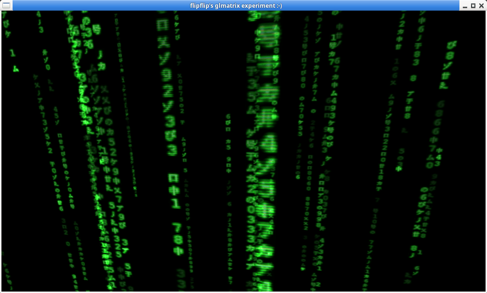

# glmatrix experiment

What's this? This is me playing with (and trying to learn) some OpenGL (and c++).

This renders the same animation like the glmatrix from [xscreensaver](https://www.jwz.org/xscreensaver/).

See [glmatrix.hpp](./glmatrix.hpp) for details.

